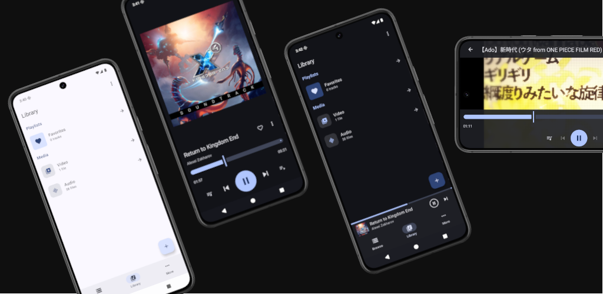

# 
ezmpv

A calm and simple offline media player for Android, built on top of libmpv through [libmpv-android](https://github.com/jarnedemeulemeester/libmpv-android).

> [!NOTE]
>
> Under development. It will reach v1.0 when the features are complete.

## Features

- libmpv
- Play audio and video
- Background playback
- Mini player
- User playlists
- Browse local files
- Audio-only mode
- Casino (true random) mode for playing tracks

## License

SPDX ID: `GPL-3.0-or-later`

This program is free software: you can redistribute it and/or modify
it under the terms of the GNU General Public License as published by
the Free Software Foundation, either version 3 of the License, or
any later version.

This program is distributed in the hope that it will be useful,
but WITHOUT ANY WARRANTY; without even the implied warranty of
MERCHANTABILITY or FITNESS FOR A PARTICULAR PURPOSE.  See the
GNU General Public License for more details.

You should have received a copy of the GNU General Public License
along with this program.  If not, see <https://www.gnu.org/licenses/>.
